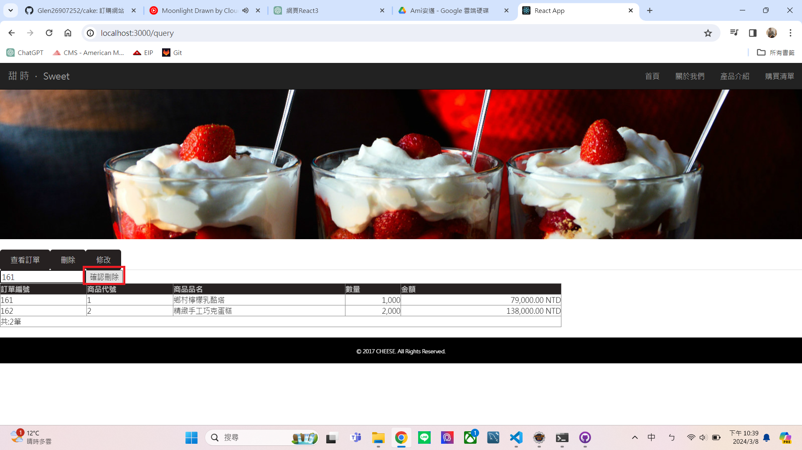
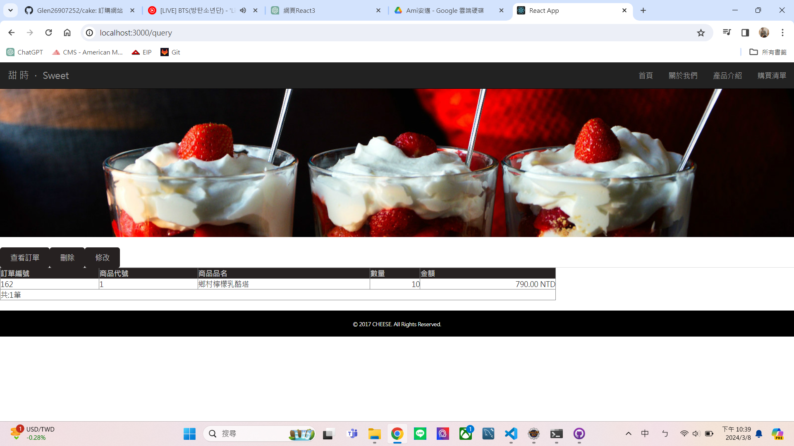

# Overview 

This is a cake shopping website with separate frontend and backend. It offers a selection of 5 products for users to choose from. Users can utilize the following functionalities: placing orders, querying orders, modifying order details, and deleting orders.

# Architecture
**`Frontend Technologies Used:`**

Project: cake-app
- **React.js:** Utilizes the JavaScript-based frontend framework to build user interfaces. The code employs features like React components, state management, and lifecycle methods.
  
- **Axios:** Utilizes Axios to send AJAX requests in both browsers and Node.js environments. It interacts with the backend by sending GET, POST, PUT, and DELETE requests to perform CRUD operations on the backend API.

- **CSS:** Utilizes CSS styles for page styling and layout control. These styles define class names and IDs to set the appearance and behavior of elements.

- **HTML:** Utilizes HTML elements for building page structure and content. These elements include image tags, buttons, input fields, tables, etc.

- **UI Components:** Utilizes various UI components to construct the user interface, such as buttons, input fields, etc. These components are defined and used using React's JSX syntax.

**`Backend Technologies Used:`**

Project: bootRs

Sub-Projects: UserProject , UserProject2

In the `bootRs` project, there are two different ORM writing styles:

- **UserProject** follows the JPA approach.
**`Backend Technologies Used:`**
1. Framework: Spring Boot
2. Component: Spring Web MVC for handling HTTP requests and responses
3. Data Access: Spring Data JPA for interacting with the database
4. Repository Interface: CakeRepository, a Spring Data JPA repository interface for CRUD operations on the Cake entity
5. Cross-Origin Resource Sharing (CORS): Enabled using the @CrossOrigin annotation to allow requests from different origins
- **UserProject2** follows the MyBatis approach.
1. Framework: Spring Boot
2. Component: Spring Web MVC for handling HTTP requests and responses
3. ORM Tool: MyBatis, which simplifies the mapping of Java objects to SQL statements and provides a simple way to interact with relational databases
4. Dependency Injection: Utilizes Spring's @Autowired annotation for dependency injection, injecting an instance of CakeServiceImpl into the controller
5. Cross-Origin Resource Sharing (CORS): Enabled using the @CrossOrigin annotation to allow requests from different origins

# Demonstration Screenshots of Web Operations

|   |   |   |
|---|---|---|
|  Index |  Products |  Add Order01 |
|  Add Order02 |  View Orders |  View Orders |
|  Delete Order |  Delete Order |  Delete Order |
|  Modify Order |  Modify Order |  Modify Order  |

